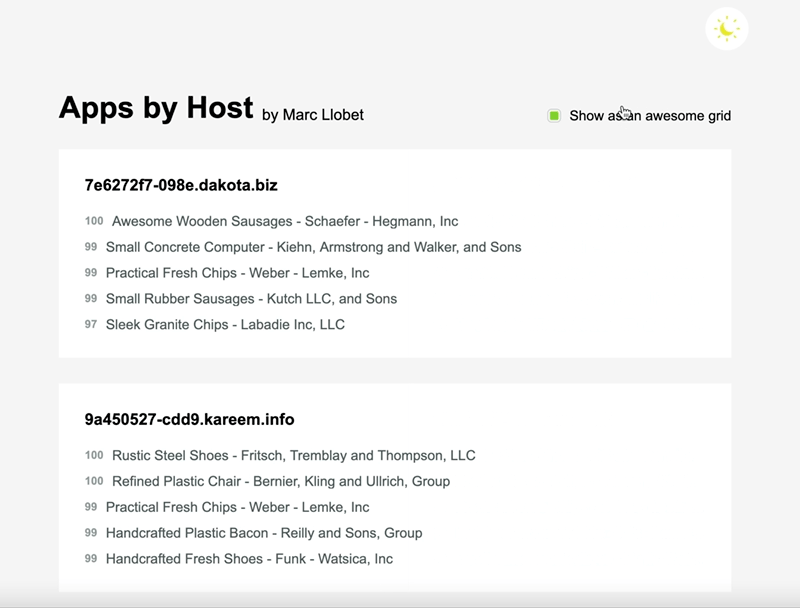
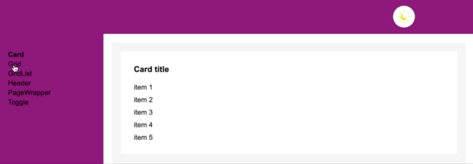

# Apps by hosts
This is an application showing the top apps in the ranking by each host.

## TLDR;
### Check it out
 - Install it: `yarn`
 - Run locally: `yarn serve`

### Other checks
 - Design system: `yarn design:system`
 - Unit tests: `yarn test`
 - Integration tests: `yarn cy:run`
 - Integration preview: `yarn cy:open`

*Preview of the final result*


*Preview of the design system*


Yes! I created a design system myself to work with the components used in this app.

*Preview of the dark theme icon*


I created a dark theme mode and an icon myself. 
Check the svg file, you will see it is quite understandable.

## Problem statement
Given we receive apps with the following shape:
```ts
Apps = {
    name: string
    host: string[]
    apdex: number
}[]
```
we need to show all hosts listing the n apps ordered by the highest apdex.

### Methods to satisfy
 - getTopAppsByHost
 - removeAppFromHosts
 - addAppToHosts

## Solution
### Data structure

```ts
DS = {
    [hostName: string]: {
        [apdex: number]: {
            [appName: string]: App
        }
    }
}
```
Dictionary of hosts as keys and a dictionary as value.

Inside, app apdex as keys and a dictionary as value.

Inside, app name as keys and the app as value.

Retrieveing an app looks like:
```js
this.hosts[hostName][app.apdex][app.name]
```

It can be seen as a tree of hosts with different layers:

```
     o         - root
     |
     o         - host names
    / \
  o     o      - apdex number
 / \   / \
o   o o   o    - app name (with app as value)
```

-   By using objects, the sorting is implicit
    by assigning the apdex number and the app name
-   Most of our actions are constant time complexity O(1)
-   Prevents collisioning

### Time complexity analysis

 - Traversing from 'apps with hosts' to 'hosts with apps' takes `O(n*h)`,
where n is the number of apps and h is the amount of different hosts.
 - Sorting Apps: O(1) Implicit with object indexation
 - Inserting Apps: O(h) ≈ O(1) where h is the height of the tree (which it's 4)
 - Removing Apps: O(1)
 - Getting a concrete app: O(1)
 - Getting n apps by host: O(n\*h) where h are hosts and n is the number of apps

## Tech stack
The idea is to use as less libraries as possible to deliver a performant and lightweight app.
I'm using 
 - typescript to enrich a little the js experience
 - webpack for build and dev purposes
 - cypress for integration tests
 - jest for unit tests
 - plain css, preventing extra complexity with preprocessors

## TODO
 - CI development
 - Increase tests coverage
 - Add component testing
 - Split design system from app completely
 - Add accessibility tests