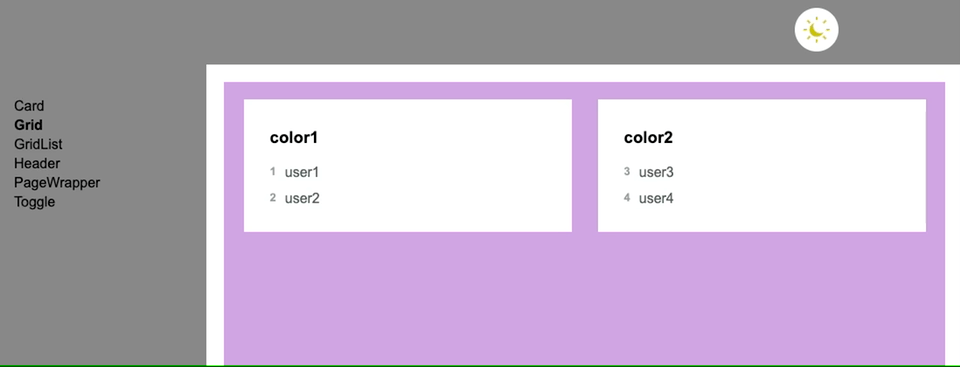

# Users by colors
This is an application showing the top users in the ranking by each color.

## TLDR;
### Check it out
 - Install it: `yarn`
 - Run locally: `yarn serve`

### Other checks
 - Design system: `yarn design:system`
 - Unit tests: `yarn test`
 - Integration tests: `yarn cy:run`
 - Integration preview: `yarn cy:open`

*Preview of the final result*


*Preview of the design system*


Yes! I created a design system myself to work with the components used in this app.

*Preview of the dark theme icon*


I created a dark theme mode and an icon myself. 
Check the svg file, you will see it is quite understandable.

## Problem statement
Given we receive users with the following shape:
```ts
Users = {
    name: string
    colors: string[]
    rank: number
}[]
```
we need to show all colors listing the n users ordered by the highest rank.

### Methods to satisfy
 - getTopUsersByColor
 - removeUserFromColors
 - addUserToColors

## Solution
### Data structure

```ts
DS = {
    [colorName: string]: {
        [rank: number]: {
            [userName: string]: User
        }
    }
}
```
Dictionary of colors as keys and a dictionary as value.

Inside, user rank as keys and a dictionary as value.

Inside, user name as keys and the user as value.

Retrieveing a user looks like:
```js
this.colors[colorName][user.rank][user.name]
```

It can be seen as a tree of colors with different layers:

```
     o         - root
     |
     o         - color names
    / \
  o     o      - rank number
 / \   / \
o   o o   o    - user name (with user as value)
```

-   By using objects, the sorting is implicit
    by assigning the rank number and the user name
-   Most of our actions are constant time complexity O(1)
-   Prevents collisioning

### Time complexity analysis

 - Traversing from 'users with colors' to 'colors with users' takes `O(n*h)`,
where n is the number of users and h is the amount of different colors.
 - Sorting Users: O(1) Implicit with object indexation
 - Inserting Users: O(h) ≈ O(1) where h is the height of the tree (which it's 4)
 - Removing Users: O(1)
 - Getting a concrete user: O(1)
 - Getting n users by color: O(n\*c) where c are colors and n is the number of users

## Tech stack
The idea is to use as less libraries as possible to deliver a performant and lightweight app.
I'm using 
 - typescript to enrich a little the js experience
 - webpack for build and dev purposes
 - cypress for integration tests
 - jest for unit tests
 - plain css, preventing extra complexity with preprocessors

## TODO
 - CI development
 - Increase tests coverage
 - Add component testing
 - Split design system from app completely
 - Add accessibility tests